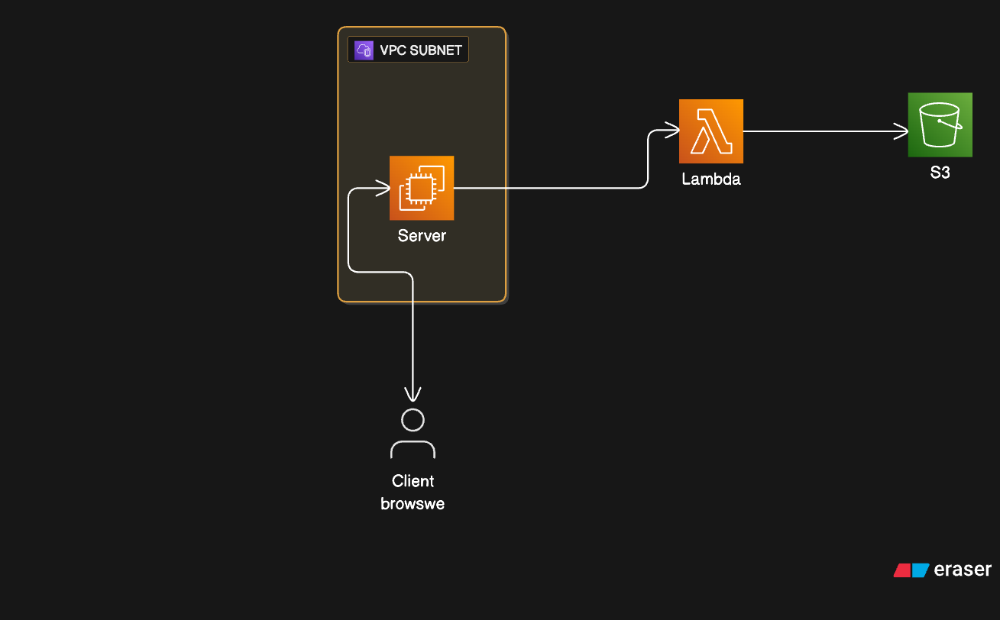

# Automated Nginx 5xx Error Resolution Bot - High-Level Overview
## Purpose
Automate the detection and resolution of 5xx errors in nginx logs to ensure application reliability and reduce manual intervention.
## System Components
- **EC2 Server:**  Hosts and runs the monitoring bot.
- **Monitoring Bot:** Continuously scans nginx logs for 5xx errors.
- **AWS Lambda Function:** Triggered by the bot to resolve detected errors.
- **S3 Bucket:** Stores solution scripts or commands for specific 5xx errors.
## Workflow Summary
1. The monitoring bot on the EC2 server scans nginx logs for 5xx errors (e.g., 500, 502).
2. Upon detecting an qualifying mistake, the bot triggers the Lambda function.
3. The Lambda function identifies the error type and retrieves the corresponding solution from the S3 bucket.
4. The solution is executed to address the detected error.
## Supported Errors
- 500 Internal Server Error
- 502 Bad Gateway
## Solution Storage
- Solutions for each error are maintained in the S3 bucket as scripts or command files.
## Intended Audience
DevOps engineers and SRE engineers are responsible for monitoring, incident response, and system reliability.

## Architecture Diagram

## Demo-Video
[video](https://youtu.be/QuhbPH2j3CA?si=ewStJdTvcfBVRr_6/)
